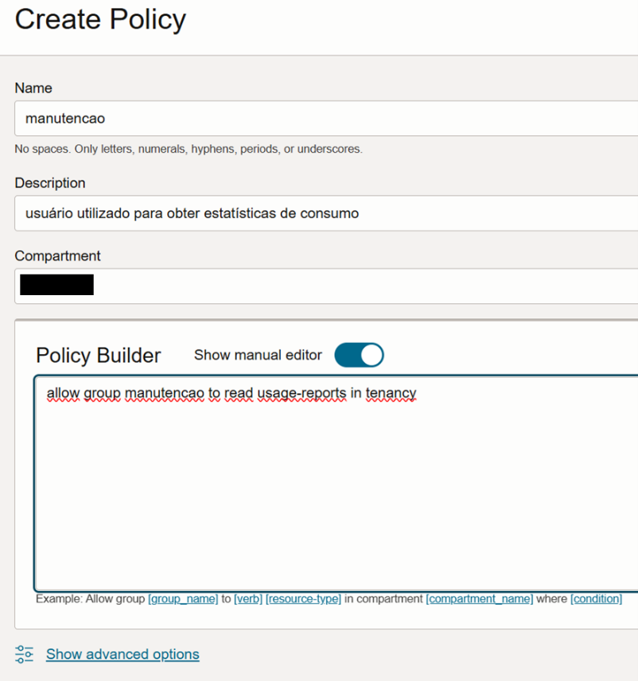
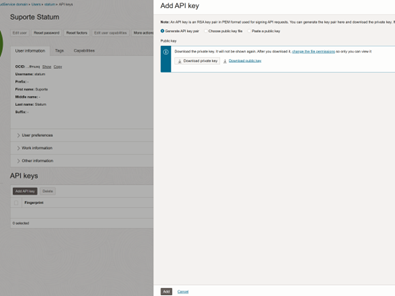
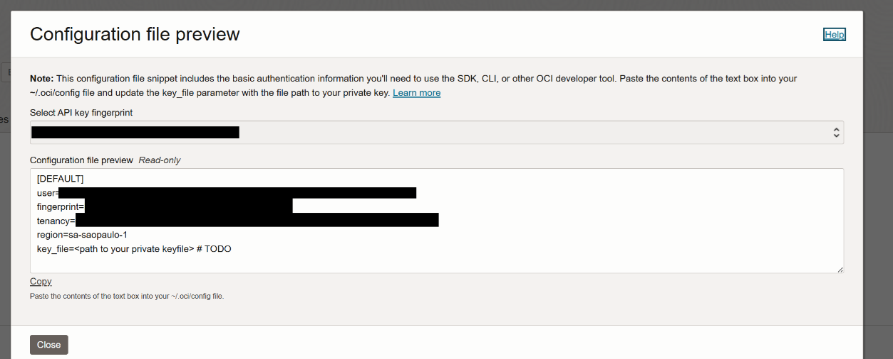
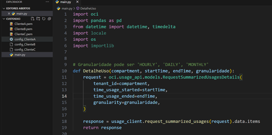
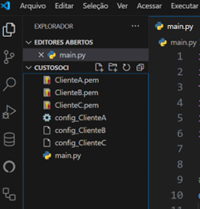
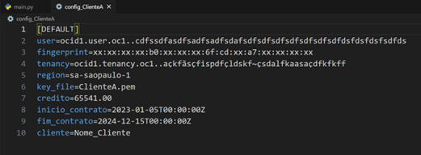
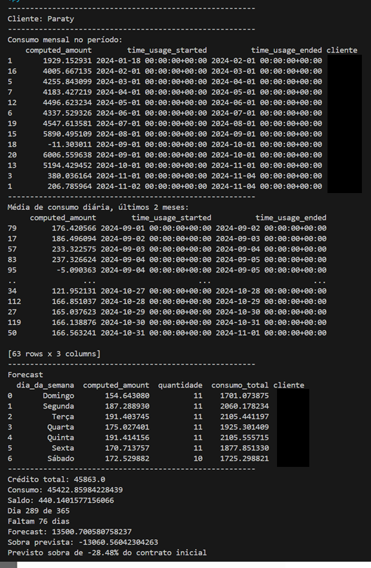
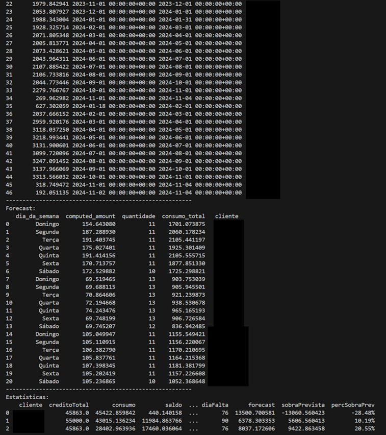

**Introdução**

Objetivo do documento é descrever uma prova de conceito de um script em Python que, por meio de API nativa da OCI extraia dados de consumo dos clientes para que possa ser utilizado em estatísticas e automação.
Código está em seu estado inicial, necessário refatoração, revisão e melhorias diversas para torná-lo adaptado a cada realidade.

**Configuração inicial**
- 1. Criar o usuário para consulta e permissões necessárias
- 2. Obter os dados de conexão fornecidos na criação do usuário
- 3. Em uma pasta inserir o script main.py
- 4. Para cada cliente a ser monitorado, inserir na pasta 2 arquivos:
	- a. um arquivo .PEM (chave de acesso à conta, obtido no ambiente)
	- b. um arquivo de configuração com os dados fornecidos pelo portal OCI ao criar usuário, além de dados adicionais de estatística do cliente
	- Obs: instrução sobre o PEM e arquivo de configuração logo abaixo.
- 5. A única biblioteca não comum utilizada foi a OCI, não esquecer de instalar o pacote antes de executar o script: “pip install OCI”

**Criação do usuário para utilização da API:**

No portal OCI, entrar no tenancy do cliente e seguir os passos:

- 1. em Identity > Policies
Criar uma nova política, informar o nome da política e em ‘resources’ estabelecer uma permissão:
*allow group manutencao to read usage-reports in tenancy*
Observação: permissão pode ser alterada conforme necessidade, no exemplo foi dada permissão “usage-reports” para o grupo “manutencao” em todo tenancy.

- 2. em Identity > Domains > Default domain > Groups
Criar um novo Grupo, no item 1, foi dada permissão para o grupo “manutenção”, portanto, criamos nesse passo um grupo com esse mesmo nome.

- 3. em Identity > Domains > Default domain > Users
	- Criar um novo usuário
	- Adicionar ao grupo: manutenção (exemplo)
	- Em Api keys: criar uma nova api key
		- baixar o arquivo private key e copiar os dados de conexão que são exibidos

**Exemplo de estrutura da pasta:**

Neste exemplo, temos 3 clientes sendo consultados, para cada cliente temos 1 arquivo .PEM e 1 arquivo de configuração.
No exemplo, utilizamos o formato ClienteA.pem e config_ClienteA. Mas pode ser utilizado qualquer nome desejado, a única regra é manter o formato “config_” no início do nome da configuração. Dentro do arquivo de configuração, há referência ao arquivo chave .PEM.
O script irá percorrer a pasta e fazer localizar todos os arquivos que inicial com “config_”, fazendo a extração de dados no portal OCI considerando cada arquivo como um cliente distinto.

**Estrutura do arquivo de configuração:**

Copie para o arquivo de configuração os dados obtidos ao criar a chave API do usuário:

	

Os dados da chave são user, fingerprint, tenancy, region e key_file.
O campo key_file deve ser preenchido com o nome do arquivo .pem que foi baixado junto com os dados da chave.
Além desses campos, foram criados mais 4 para uso no script:
credito: é o valor total do crédito que foi disponibilizado para o cliente no contrato atual, que está sendo analisado.
inicio_contrato: a data do início do contrato corrente que está sendo analisado.
fim_contrato: a data do fim do contrato.
cliente: o nome do cliente para que seja exibido nas estatísticas.

Obs: todos os dados de credito e datas podem ser obtidas no próprio portal, no cadastro do cliente.

**Resultado do script:**

Ao executar o script, serão exibidos um relatório para cada cliente mostrando:
- consumo do cliente nos meses entre o início do contrato até a data que está sendo executado
- média de consumo diária nos últimos 2 meses para cálculo do forecast
- forecast, considerando o consumo segundo o dia da semana, exibindo o valor calcula de consumo por dia da semana, quantidade de dias restantes até o final do contrato e valor previsto
- estatísticas diversas mostrando o consumo, forecast e sobra ou débito estimados

 
E, ao final, será exibido um relatório acumulando os dados de todos os clientes consultados:

**Considerações finais:**

Esse script deve ser considerado apenas como modelo inicial para uma rotina de extração de dados. Dentre muitas possibilidades, algumas propostas de melhoria:
- armazenar os dados dos data frames em um banco de dados ou planilhas
- rodar o script em um tenancy no portal OCI, gravando os resultados dos data frames em um banco
- conectar o Oracle Analytics ou outra ferramenta de BI
- criar alertas e enviar e-mail ou mensagens (sms, whatsapp)
- criar um app mobile para acesso pelo cliente às informações

Além disso, o script não foi testado e validado em todos os cenários possíveis. Algumas checagens de erro devem ser acrescentadas e alguns cálculos podem ser alterados para adaptar a realidades diversas.
Os métodos de cálculo de forecast podem ser alterados conforme necessidade. Nesse exemplo, foi utilizado apenas a média de consumo dos dois últimos meses e foi considerado o consumo por dia da semana. Diversos outros cenários podem ser testados.
Para dúvidas adicionais, acionar a equipe em suporte@statum.com.br.

